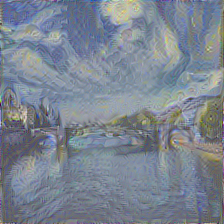
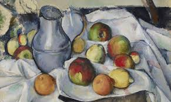
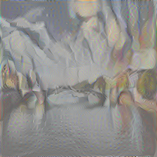

# neural_style_tensorflow
neural style : Image Style Transfer Using Convolutional Neural Networks

A simple implementation of 'Image Style Transfer Using Convolutional Neural Networks' , to see what it does!

Download vgg19 pre-trained : http://www.vlfeat.org/matconvnet/models/beta16/imagenet-vgg-verydeep-19.mat
vgg.py is borrowed from 'https://github.com/anishathalye/neural-style'

- Need to fine-tune for hyperparameters ( lr / lr decays... )

bridge input

gogh style input

 

gogh-bridge result

 

style_3 input

style_3-bridge

 
